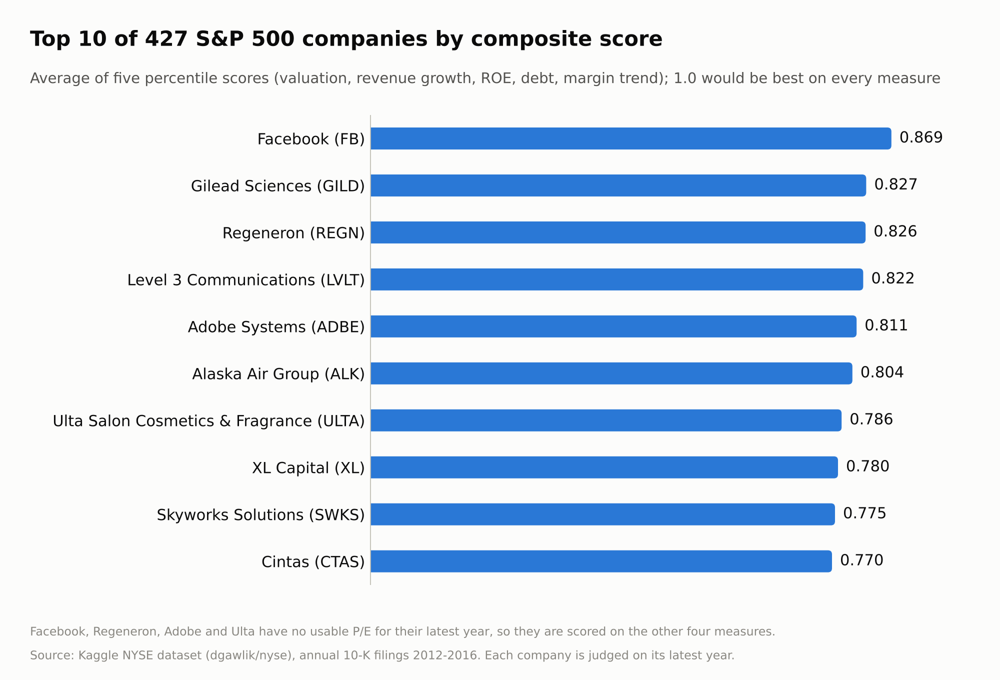
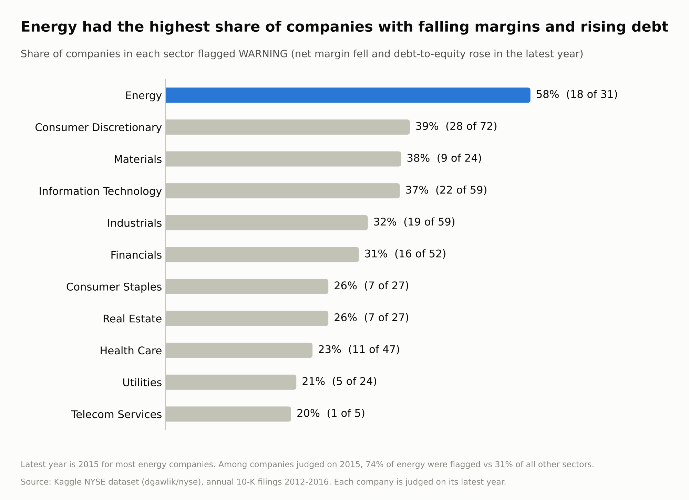
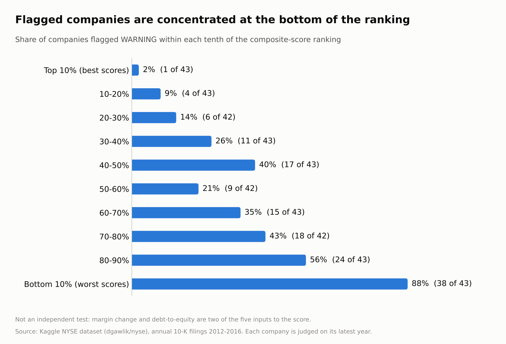

# Company Fundamentals Screener (SQL)

A SQL project that ranks 427 S&P 500 companies on valuation, growth, profitability and leverage, and flags companies whose margins are falling while their debt is rising. Built in SQLite from three linked tables of real company filings and share prices.

**Question:** using only annual financial statements and share prices, can a transparent set of SQL rules separate strong companies from weak ones?

## Results

**Top 10 by composite score:** Facebook, Gilead Sciences, Regeneron, Level 3 Communications, Adobe, Alaska Air, Ulta, XL Capital, Skyworks, Cintas.

**Energy stood out on the warning flag.** 58% of energy companies (18 of 31) showed falling net margin and rising debt-to-equity in their latest year, against 20 to 39% in every other sector. Most energy companies' latest year is 2015, the year of the oil price fall. Comparing only companies judged on 2015, 74% of energy companies were flagged against 31% of all other sectors, so the gap is not just a difference in which year each company was measured.

**Flagged companies sit at the bottom of the ranking.** 88% of the lowest-scoring tenth are flagged (38 of 43), against 2% of the highest-scoring tenth (1 of 43). This is a consistency check rather than an independent test, because margin change and debt-to-equity are two of the five inputs to the score.

## Data

Kaggle "New York Stock Exchange" dataset (`dgawlik/nyse`):

| File | Contents |
|---|---|
| `fundamentals.csv` | Annual 10-K line items, 448 companies, 1,781 company-years, 2012-2016 |
| `securities.csv` | Ticker, company name, sector |
| `prices.csv` | Daily share prices, 851,264 rows, 2010-2016 |

### Data quality issues found and handled
- **Procter & Gamble's rows are a copy of Regeneron's financials.** The file reports P&G revenue of about $2.1bn to $4.9bn, when the real figure is far higher. A self-join on identical financials found the problem (section 0 of the SQL file), and P&G is excluded.
- **Three companies appear twice as two share classes** (Under Armour, News Corp, Discovery) with identical financials. One class of each is excluded so no company is counted twice.
- **Date formats differ in `prices.csv`.** About 2,000 rows carry a time part, which would silently break date matching. They are standardised first.
- **Missing and negative values.** Earnings per share is blank for 219 rows. ROE and debt-to-equity are set to NULL when shareholders' equity is zero or negative, and P/E is NULL when earnings per share is zero or negative, because the ratios are not meaningful there.

## Method

All SQL is in [`company_screener.sql`](company_screener.sql).

1. **Prepare prices.** Standardise dates and index the table so lookups are fast.
2. **Build a metrics view** (`company_metrics`), one row per company per year:
   - Net margin, ROE (net income / equity), debt-to-equity (total debt / equity)
   - P/E, using the share price on the last trading day on or before each fiscal year-end (within 10 days)
   - `LAG()` window functions for year-on-year revenue growth, margin change and debt-to-equity change
3. **Score each company's latest year.** Using `PERCENT_RANK()`, each company gets a score from 0 (worst) to 1 (best) on five measures: P/E (lower is better), revenue growth, ROE, debt-to-equity (lower is better) and margin change. The composite score is the average of the scores available. Percentile ranks mean a single extreme value, such as a P/E above 7,000, cannot distort the ranking.
4. **Flag** companies where margin fell and debt-to-equity rose in the latest year.

SQL used: joins, CTEs, a view, a correlated subquery, `LAG`, `PERCENT_RANK`, `RANK`, `ROW_NUMBER`, `CASE`, `COALESCE`, `NULLIF`.

## Limitations

- **The data is historical (2012-2016).** This is a methodology exercise, not a current market view, and nothing here is investment advice.
- **Companies are judged on different years.** The latest year is 2015 for 221 companies and 2016 for 205 (one is 2017), because fiscal years end on different dates.
- **P/E is missing for 149 of the 427 ranked companies** (earnings per share is blank or negative). They are scored on the other four measures, so composite scores are not perfectly like-for-like. A company needs at least four of the five measures to be ranked, which leaves out 17 companies.
- **Equal weights are a judgement call.** Averaging the five scores equally is simple and transparent, but it is not the only reasonable choice, and the scores are not adjusted for sector.
- **The score has not been tested against later returns.** Checking whether top-ranked companies actually did better would be the natural next step.
- **Single-year signals are noisy.** The warning flag looks at one year of change only.

## Reproduce

1. Download the three CSVs from Kaggle (`dgawlik/nyse`).
2. Import each into SQLite (for example with DB Browser for SQLite) as tables named `fundamentals`, `securities` and `prices`, with column names taken from the first line.
3. Run sections 1 to 3 of `company_screener.sql` in order. Section 0 is an optional data-quality check.

`screener_results.csv` contains the full ranked output (427 rows).
